Financial Stress Index Data
===========================


The R package ```stressr``` provides convenient access to the financial stress index and components data provided by the Federal Reserve Bank of Cleveland.  The package provides data download functions and some representative plots along the same categories as provided by the bank. See the [FRB's terms of use](http://www.clevelandfed.org/utilities/terms_of_use.cfm?DCS.nav=Footer) regarding these data.   

As a simple example of gathering data and drawing simple plots consider the R code
```{r}
require(stressr)
require(lattice)
idx <- getStressIndex()
stressIndexChart(idx,"2007/")
```

Several examples of plots are shown by category below.  For details on each query and more example plots, please see the package vignette.  

Index Report
------------
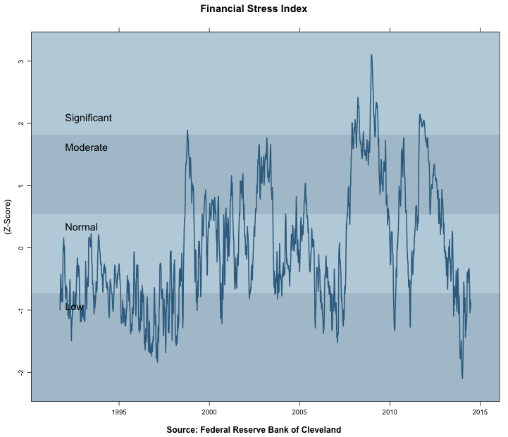

Summary Report
--------------

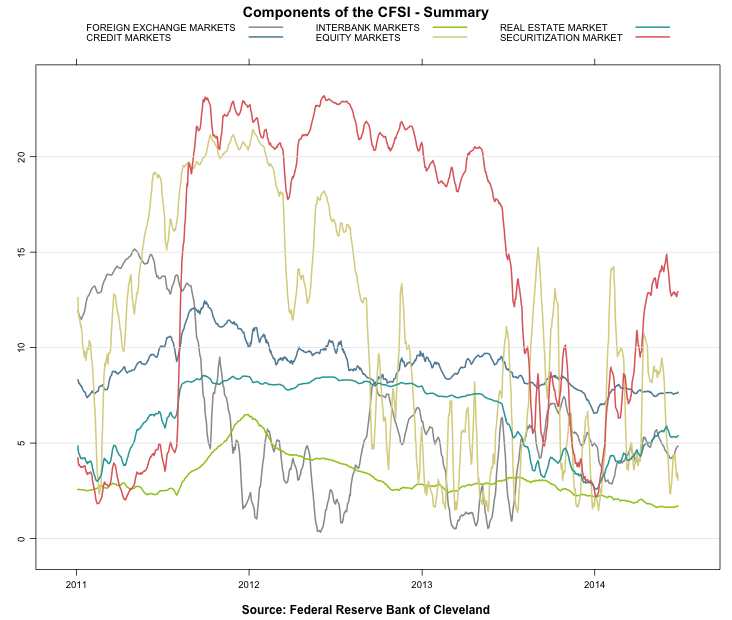
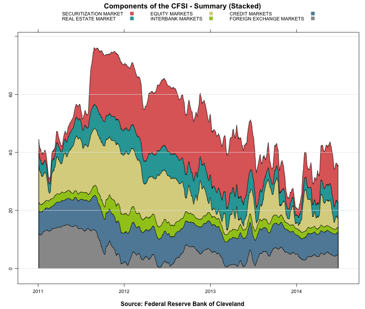


Securitization Markets
----------------------
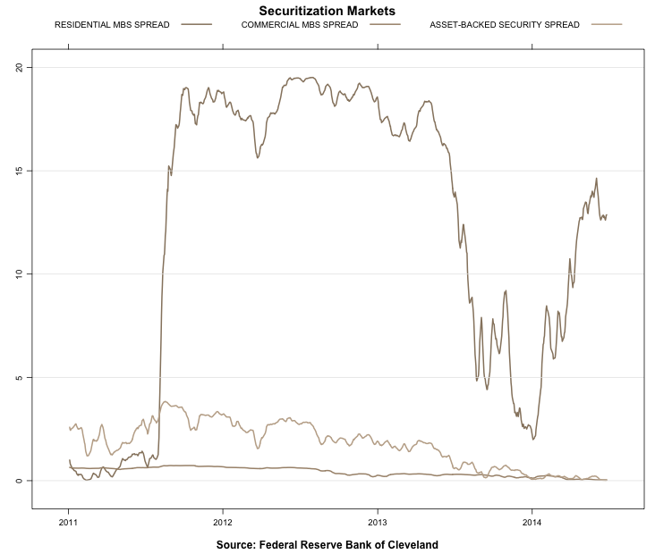
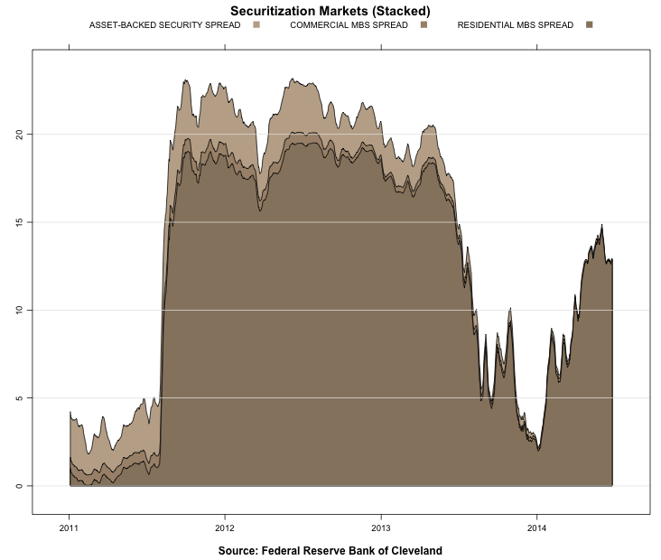

Real Estate Markets
-------------------
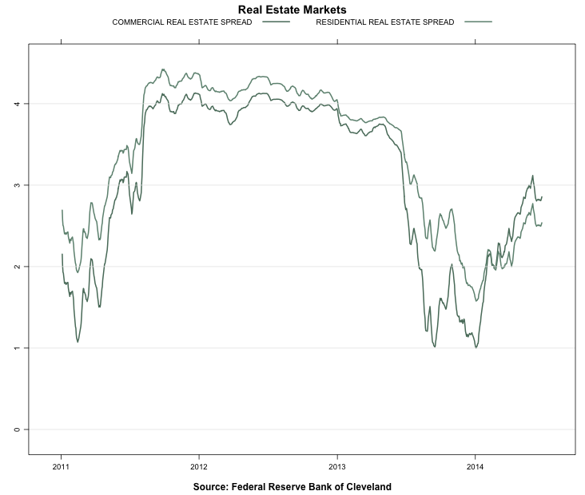
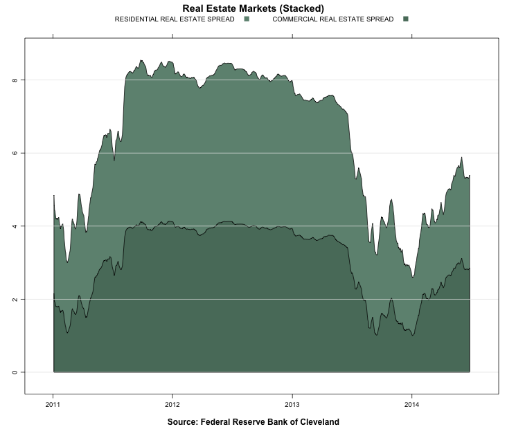

Funding Markets
---------------
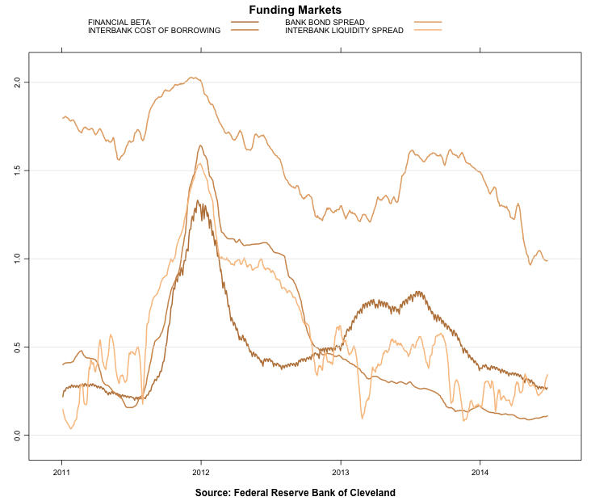
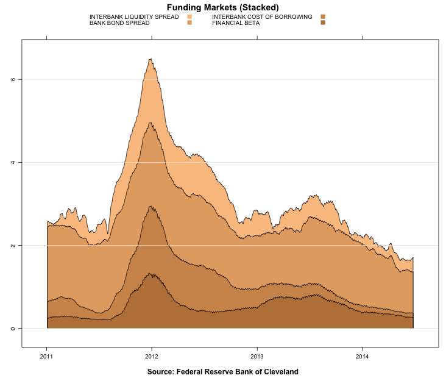

Foreign Exchange Markets
------------------------
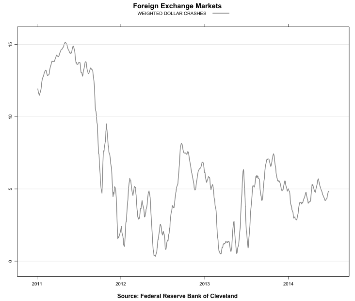


Equitiy Markets
-----------------------------
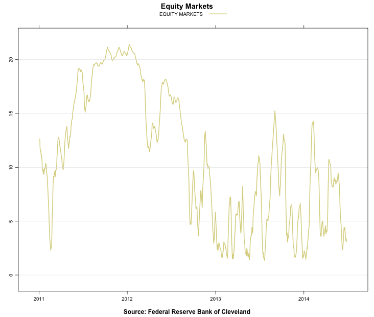
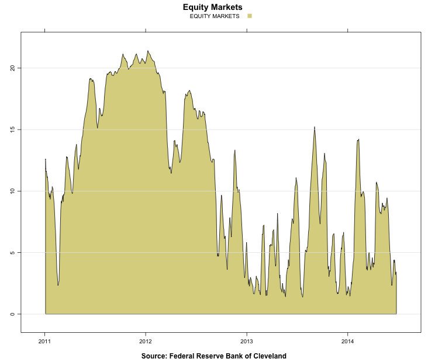

Credit Markets
--------------------------------------------------
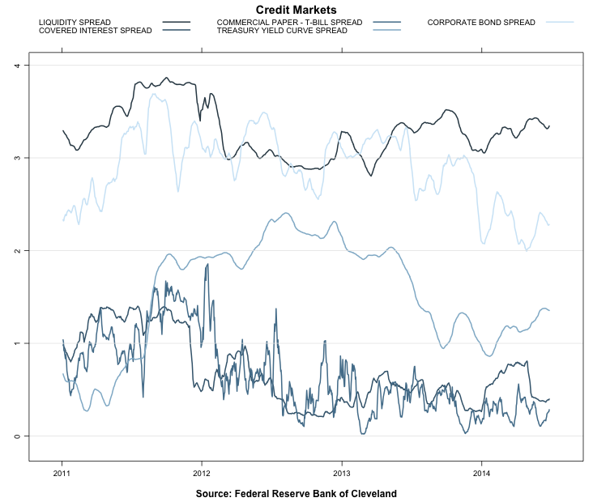
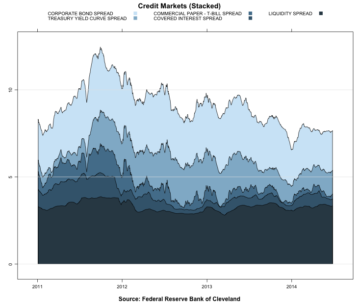

Index Components
----------------
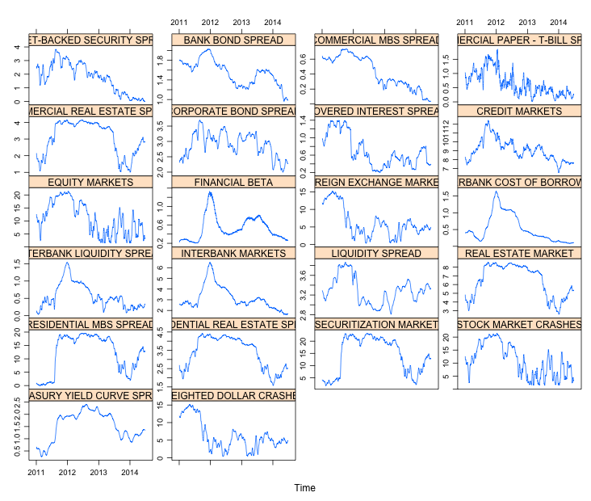


References
----------
* See [Cleveland FRB](http://www.clevelandfed.org/research/data/credit_easing/index.cfm) for more details.

